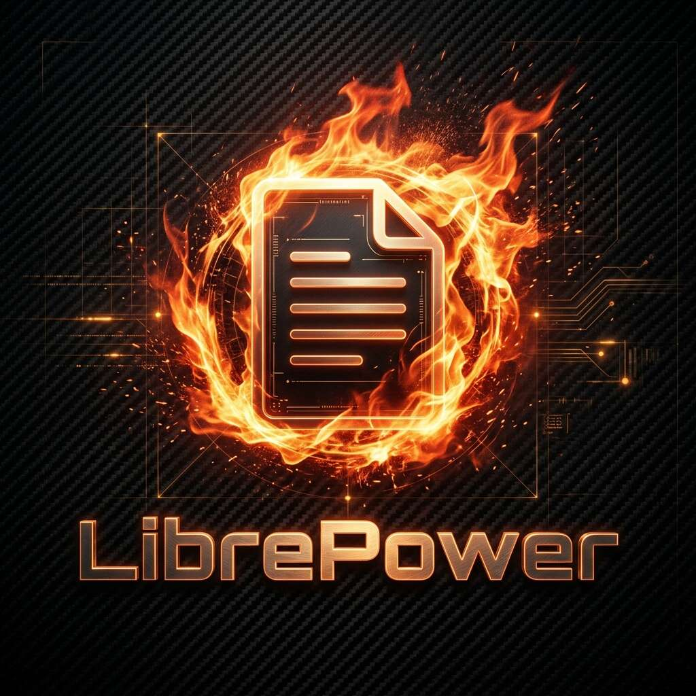

<p align="center">
  
</p>

<h1 align="center">🔥 LibrePower: Total Chaos Edition</h1>

<p align="center">
  <b>Turn LibreOffice Writer into an action arena. Feel the heat of every keystroke.</b>
</p>

<p align="center">
  <a href="https://github.com/zedraxa/LibreWriter-PowerMode/actions"></a>
  <a href="https://github.com/zedraxa/LibreWriter-PowerMode/releases"></a>
  <a href="https://github.com/zedraxa/LibreWriter-PowerMode/blob/main/COPYING.MPL"></a>
</p>

---

**LibrePower** is a high-performance visual engine patched into [LibreOffice Writer](https://www.libreoffice.org/). It transforms the act of typing into an immersive, gamified experience — designed to maximize motivation through cinematic feedback.

This is **not** a plugin or extension. It is a direct C++ modification of the LibreOffice Writer source code.

---

## 🌪️ Total Chaos Features

| Feature | Description |
| :--- | :--- |
| 🔥 **Fire Engine** | Cinematic flame animations that grow and intensify with your typing speed |
| 🧱 **Debris System** | Concrete-like particles fly from the cursor with realistic gravity physics |
| ✨ **Ember Particles** | Rising sparks and glowing embers fill the screen during high-speed streaks |
| 🫨 **Screen Shake** | Every keystroke vibrates the entire viewport — scales with your combo level |
| 💓 **Pulsing Combo** | A reactive "WORD COMBO!" display that breathes and shakes with your streak |
| 🌡️ **Speed Heat** | The faster you type, the brighter and more intense the flames become |
| 🔘 **One-Touch Toggle** | Fire Mode button in the Writer toolbar — instant on/off |

---

## 📦 Getting Started

### Download the Patch
Go to the [Releases](https://github.com/zedraxa/LibreWriter-PowerMode/releases) page and download `librepower-patch.tar.gz`.

### Build from Source

```bash
# 1. Clone LibreOffice core
git clone --depth 1 https://github.com/LibreOffice/core.git
cd core

# 2. Apply the LibrePower patch (extract over the source tree)
tar xzf /path/to/librepower-patch.tar.gz

# 3. Configure & build Writer only
./autogen.sh --disable-calc --disable-draw --disable-impress
make sw

# 4. Launch Writer
./instdir/program/soffice --writer
```

### Toggle Fire Mode
Once Writer is running, click the **🔥 Fire Mode** button in the toolbar. Start typing and watch the chaos unfold.

---

## 🏗️ Architecture

LibrePower lives entirely within the `sw/` (Writer) module of LibreOffice:

```
sw/
├── source/uibase/
│   ├── inc/
│   │   ├── flameengine.hxx     # Core engine: particles, physics, rendering
│   │   └── powermode.hxx       # Toggle manager & effect lifecycle
│   ├── docvw/
│   │   ├── flameengine.cxx     # Fire, debris, embers, shake, combo logic
│   │   └── edtwin2.cxx         # Paint hook & global screen shake injection
│   └── uiview/
│       └── view0.cxx           # FN_TOGGLE_POWER_MODE command handler
├── inc/
│   └── cmdid.h                 # Command ID registration
├── sdi/
│   └── swriter.sdi             # Slot definition for the toggle
└── Library_sw.mk               # Build system integration
```

---

## 🎬 How It Works

1. **KeyInput** in `edtwin.cxx` detects keystrokes and feeds them to `FlameEngine`
2. `FlameEngine` manages a real-time particle system with physics simulation (gravity, velocity, decay)
3. On every **Paint** call in `edtwin2.cxx`, the engine renders flames, debris, embers, and combo text
4. **Screen shake** is injected by offsetting the `MapMode` origin of the `RenderContext`
5. **Speed Heat** tracks typing cadence and dynamically scales particle intensity

---

## 📜 License

LibrePower is built on top of [LibreOffice](https://www.libreoffice.org/) and is subject to the [Mozilla Public License, v. 2.0](COPYING.MPL).

---

<p align="center">
  <i>"Hackers and writers welcome. Let the flames guide your pen."</i> 🔥🦾
</p>
